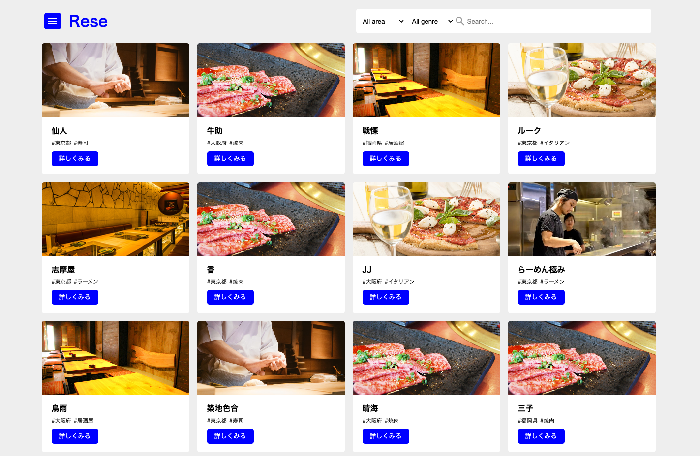
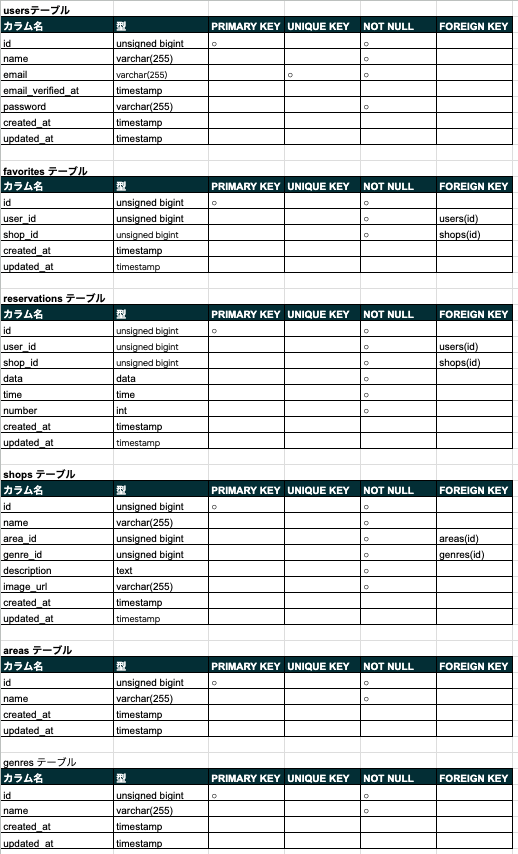
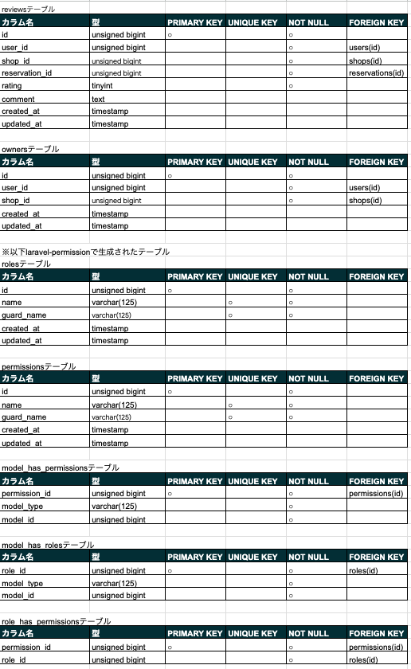
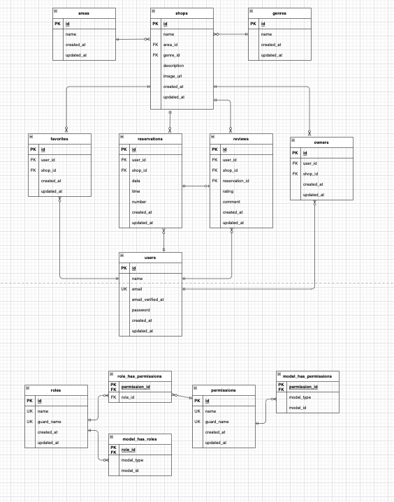

# Rese(飲食店予約システム)
**様々な飲食店が載っておりログイン後、店舗の予約やお気に入りを追加、レビューの投稿ができます  
管理者や店舗代表者はそれぞれ管理画面にログインできます**  


## アプリケーションを作成した目的
**上級模擬案件として作成**

## アプリケーションのURL
**http://43.207.192.236**

## 機能一覧
- 新規登録機能
- ログイン機能
- 飲食店お気に入り追加・削除
- 飲食店予約情報確認・追加・変更・削除
- 飲食店検索機能
- 飲食店評価機能
- 店舗代表者作成機能
- 店舗情報の作成・変更
- メール認証機能
- お知らせメール送信機能
- リマインダー
- QRコード発行
- 決済機能

## 使用技術(実行環境)
- PHP 7.4.9
- Laravel 8.83.8
- MySQL 8.0.26
- javascript
- laravel-fortify
- laravel-permission
- simple-qrcode
- stripe

## テーブル設計



## ER図


## 環境構築
**Dockerビルド**
1. git clone git@github.com:cote07/Rese.git
2. cd Rese
3. docker-compose up -d --build

**Laravel環境構築**
1. docker-compose exec php bash
2. composer install
3. cp .env.example .env
4. .envに以下の環境変数を追加
   >  MAIL_USERNAME,  MAIL_PASSWORD,  MAIL_FROM_ADDRESS には自身で用意したmailtrapの情報を設定してください
   >  STRIPE_KEY,  STRIPE_SECRET　には自身で用意したstripeの情報を設定してください
``` text
APP_NAME=Rese
```
``` text
DB_CONNECTION=mysql
DB_HOST=mysql
DB_PORT=3306
DB_DATABASE=laravel_db
DB_USERNAME=laravel_user
DB_PASSWORD=laravel_pass
```
``` text
MAIL_MAILER=smtp
MAIL_HOST=smtp.mailtrap.io
MAIL_PORT=2525
MAIL_USERNAME=
MAIL_PASSWORD=
MAIL_ENCRYPTION=null
MAIL_FROM_ADDRESS=
MAIL_FROM_NAME="${APP_NAME}"
```
``` text
STRIPE_KEY=
STRIPE_SECRET=
```
5. php artisan key:generate
6. php artisan migrate
7. php artisan db:seed
8. php artisan storage:link
    >  権限付与が必要な場合は下記のコマンドを実行してください
    ``` text
    chmod -R 775 public
    chmod -R 775 storage
    chmod -R 775 bootstrap/cache
    ```
9. php artisan schedule:work

**URL**
- 開発環境：http://localhost/
- phpMyAdmin：http://localhost:8080/

## 権限の説明(ダミーデータ)
- ユーザー
**Email user@example.com**

- 管理者
**Email admin@example.com**

- 店舗代表者  
**Email owner1@example.com shop_id:1,2,3,4の代表**  
**Email owner2@example.com shop_id:5,6,7,8の代表**  
**Email owner3@example.com shop_id:9,10,11,12の代表**  
**Email owner4@example.com shop_id:13,14,15,16の代表**  
**Email owner5@example.com shop_id:17,18,19,20の代表**

*パスワードはpasswordです*
